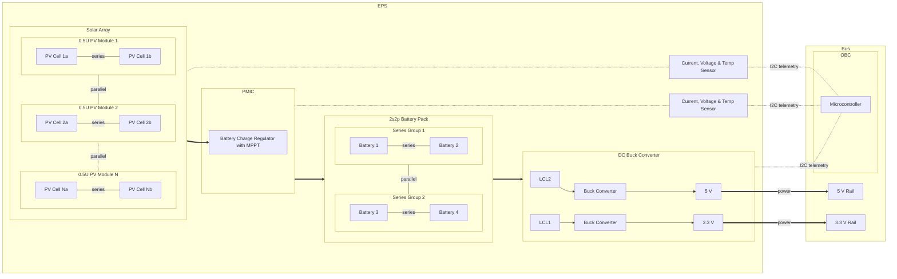

# EPS v1
## Requirements
[comment]: <> (TODO turn reqs into specs on first release)
v1 of the EPS takes a low-effort approach to facilitate achieving an MVP for the whole system before starting to optimise individual subsystems. Given requirements for all parts are:

- Wide operating temperature range (industrial or automotive grade)
- Easy implementation (low BOM, good EMI/SI characteristics, solid documentation)
- Predictable availability
- Reasonable cost
- As few plastic parts as possible (low outgassing)

### PMIC
#### Minimal Requirements
- [x] Usable for both USB and solar charging
- [x] MPPT
- [x] 2S Li-Ion battery charging
- [x] Enable input pin
- [x] Fault output pin
- [x] Full complement of safety features: OVP, OCP, OTP, RVP, BBD

#### Optional Requirements
- [x] Fault output pin
- [x] Support for 1s to 4s battery packs
- [x] Support for LiFePo4 batteries
- [ ] I2C telemetry
- [ ] Adjustable charging current
- [ ] Cell balancing for 2s and 4s battery packs

### DC Buck Converter
#### Minimal Requirements
- [x] Input voltage range: 6 V to 9 V
- [x] Output voltage range: 3.3 to 5 V
- [x] 3 A per output
- [x] Enable pin
- [x] Fault output pin
- [x] Full complement of safety features: OCP, OVP, SCP, OTP, UTP, UVLO

#### Optional Requirements
- [x] 17 V input
- [x] 5 A per output
- [x] I2C telemetry
- [x] Fault output pin

### Batteries
#### Main Battery Pack (2s2p configuration)
- [x] 18650 size
- [x] Li-NiMnCoO2 or LiFePo4 chemistry
- [x] Minimum 3.5 Ah capacity
- [x] Operating temperature range: -10°C to +40°C or better
- [x] High cycle count
- [x] UL-listed

#### Coin Cell
- [x] 2032 size
- [x] LiMnO2 chemistry
- [x] Minimum 50 mAh capacity
- [x] Operating temperature range: -10°C to +40°C or better
- [x] Ideally rechargeable
- [x] UL-listed

### Solar Cells (2sNp configuration)
- [x] Size that fits a 0.25 U panel
- [x] Monocrystalline
- [x] 25% efficiency or better
- [x] Thin and light
- [x] Low-outgassing materials
- [x] Operating temperature range: -20°C to +80°C or better

## Block Diagram

## Part Selection
### PMIC
- Manufacturer: Analog Devices
- Model: LTM8062 ([datasheet](https://www.analog.com/media/en/technical-documentation/data-sheets/8062fd.pdf))
- Part number: TBD
- Eval Board: DC1621A ([manual](https://www.analog.com/media/en/technical-documentation/user-guides/dc1621af.pdf))

### DC Buck Converters
- Manufacturer: Analog Devices
- Model: LTM4675 ([datasheet](https://www.analog.com/media/en/technical-documentation/data-sheets/ltm4675.pdf))
- Part number: TBD
- Eval Board: DC2053A ([manual](https://www.analog.com/media/en/technical-documentation/user-guides/DC2053AFA.PDF))

### Main Batteries
- Manufacturer: LG
- Model: MJ1 ([datasheet](https://files.batteryjunction.com/frontend/files/lg/datasheet/LG-MJ1-Datasheet.pdf))
- Part number: INR18650MJ1

### Coin Cell Battery
[comment]: <> (TODO move to OBC)
#### Option 1
- Manufacturer: Maxell
- Model: ML2032 ([datasheet](https://biz.maxell.com/en/rechargeable_batteries/ML2032_DataSheet_17e.pdf))
- Part number: ML2032 T25
#### Option 2
- Manufacturer: Maxell
- Model: CR2032HR ([datasheet](https://biz.maxell.com/en/primary_batteries/CR2032HR_DataSheet_20e.pdf))
- Part number: TBD

### Solar Cells
- Manufacturer: Anysolar
- Model: SM141K10TF ([datasheet](https://waf-e.dubudisk.com/anysolar.dubuplus.com/techsupport@anysolar.biz/O18BEt5/DubuDisk/www/Gen3/SM141K10TF%20DATA%20SHEET%20202105.pdf))
- Part number: SM141K10TF (contacts 3mm from edge) or SM141K10TFS (contacts 10mm from edge)

## Notes
This EPS is intentionally kept minimal. At the moment, there is no uC because this is supposed to be a simple device, that works as soon as the RBF and deployment switches are disengaged until one of the ICs detects an off-nominal state and shuts itself down. All telemetry and external control is going to be offloaded to a uC in the OBC via I2C.

## Disclaimer
This EPS is very much a work in progress and is in no way tested or qualified for spaceflight. Please [read the disclaimer](https://codeberg.org/buildacubesat-project/bac-hardware/src/branch/main/eps/DISCLAIMER.md) before working with this repo.

### Layout
- Pin spacing is breadboard-friendly (2.54 mm), but the spacing between groups of pins is not necessarily a multiple of 2.54 mm.
- Signal names are silkscreened on the board, top and bottom layers, where relevant.
- Panelized manufacturing files are not included.
- I recommend a stencil for assembling this board.

### PCB
- Dimensions: TBD mm * TBD mm
- Layer count: 4
- Stackup: TBD
- Thickness: 1.6 mm

## ECAD
- Software: KiCad
- Version: 8

### Future Development
- Add redundancy and watchdog circuitry
- Add dedicated load switches or MOSFETs instead of relying on the IC's internal ones for RBF and deployment switches
- Add dedicated resettable current limiters instead of relying on the DC-converter internal ones
- Add adjustable charging current
- Add full compatibility for 1s4p, 2s2p and 4s1p battery pack configurations
- Add cell balancing

### Future Investigation
- Do we need active battery heating?
- Do we need a buck-boost converter to 12 V or should we stick with bucking to 5 V and if necessary boosting to 12 V off-board? (what I believe is called a cascade configuration)

