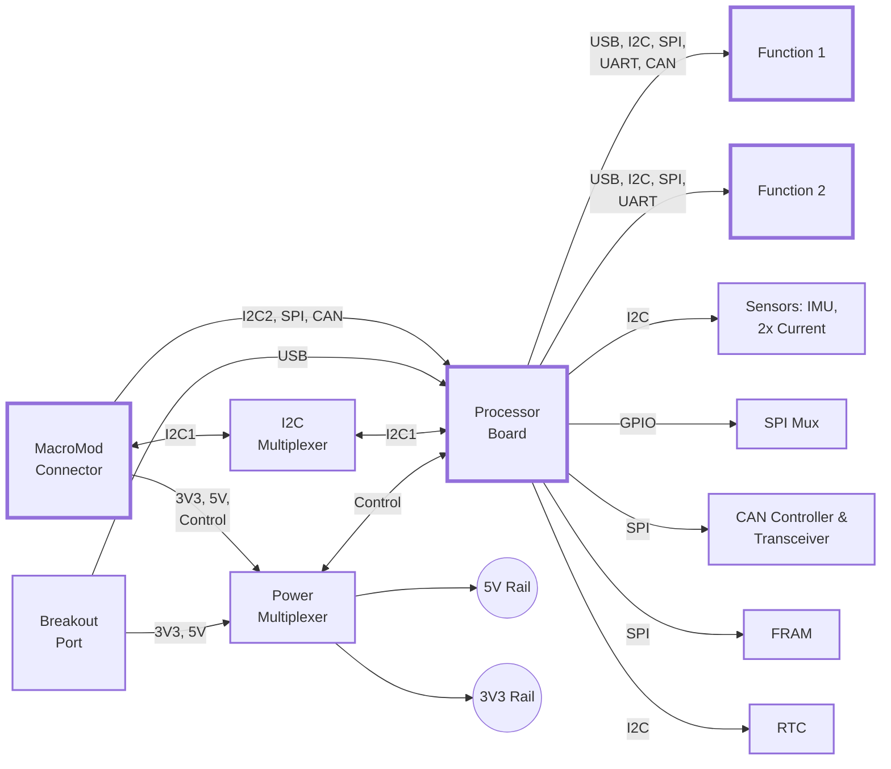

## MicroMod-Compatible Dual Function, Single bacBus Carrier Board

### Status: Work in Progress

This PCB is in active development and as such fully untested.

## About this PCB

The purpose of this board is to offer an affordable way to quickly iterate on a _Build a CubeSat_ prototype using Sparkfun MicroMod. It will accept one processor board and up to two function boards and should be compatible with all of Sparkfun's offerings in that regard. Also, developing custom compatible hardware is relatively easy: [Designing with MicroMod](https://learn.sparkfun.com/tutorials/designing-with-micromod)

## Built With

The basis of this board is the schematic for [Sparkfun's MicroMod Main Board Double](https://github.com/sparkfun/SparkFun_MicroMod_Main_Board_Double) by Elias Santistevan (CC BY-SA 4.0)

## Functionality

The block diagram is indicative of the functionality. See the schematic for a full overview. Further information also in [s02e01 on YouTube](https://www.youtube.com/watch?v=qRI9FKMDtNg).

### Block Diagram

## Roadmap

Development of r1 should be finished in February 2025, at which point this README will get updated with the relevant information.

## Specs

### Schematic PDF

TODO

### Stackup

TODO

### Physical Dimensions

TODO

### Ordering from a Fab

TODO

### Known Bugs and Limitations

- The main limitation of this board is that it only connects to one bacBus (which is what I call the main buses on the satellite, formerly known as MacroMod). This is intentional and a dual bus variant may follow.

## License

In accordance with Sparkfun's licensing of [MicroMod Main Board Double](https://github.com/sparkfun/SparkFun_MicroMod_Main_Board_Double) by Elias Santistevan as CC BY-SA 4.0, this PCB is licensed under CC BY-SA 4.0 too (see LICENSE for further information).

## Acknowledgments

The stackup has been inspired by [Pierluigi Colangeli's CM5 MINIMA](https://github.com/piecol/CM5_MINIMA_REV2).

## Contributing

Contributions to the _Build a CubeSat_ hardware ecosystem are highly appreciated! To keep things structured, here’s how you can contribute:

### 🔧 **Fixes & Improvements to Existing Designs**  
- If you’re **fixing a bug, optimizing an existing design, or making incremental improvements**, please:  
  1. Create a **new feature branch** in this repository (`git checkout -b feature/your-feature-name`).  
  2. **Commit** your changes (`git commit -m 'Brief description of change'`).  
  3. **Push** to the branch (`git push origin feature/your-feature-name`).  
  4. Submit a **Pull Request (PR)** with a clear description of the changes. Keep your PRs focused – one fix or improvement per PR is ideal.  

### 🚀 **New Designs & Community Contributions**  
- If you’re designing something **new**, like a module, testing jig, expansion board, or an accessory:  
  - **Create your own repository** (e.g., on Codeberg, GitHub, or another platform).  
  - Feel free to **share a link** in our community discussions or open an issue to let us know about it!  
  - If your project is relevant to the community, I will gladly **reference it in the docs**.  

This approach helps keep the core project focused while encouraging community-driven innovation. Thanks for contributing! 🙌  

## Supporting This Project

I am truly grateful for your insights about how this PCB could be improved.  
If you’d like to support the _Build a CubeSat_ project further, consider these options:  
- [Patreon](https://www.patreon.com/buildacubesat)  
- [KoFi](https://ko-fi.com/buildacubesat)  
- [PayPal](https://tinyurl.com/bac-donate)  
